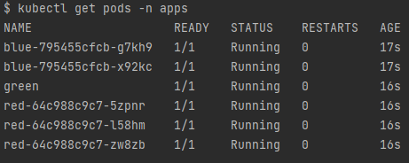
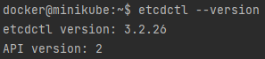
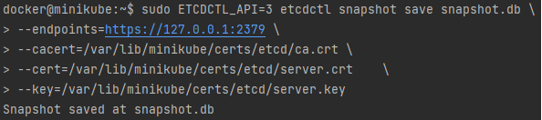
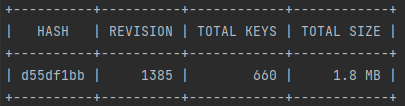
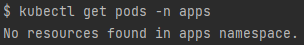
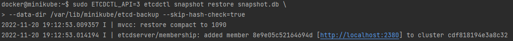
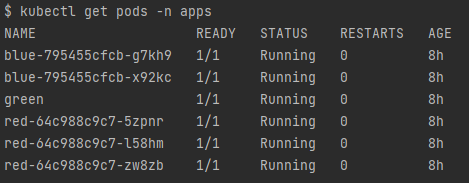

# ETCD backup and restore exercise
`etcd` is a consistent and highly-available key-value store used as Kubernetes' backing store for all cluster data.

If your Kubernetes cluster uses `etcd` as its backing store (which is by default), it means that all of your cluster objects and their related data are stored on the `etcd` server.

Therefore, periodically backing up the `etcd` cluster data is important to recover Kubernetes clusters under disaster scenarios, such as losing all `controlplane` nodes.

For that exact purpose we can utilize the `etcdctl` CLI (command line interface) which offers the ability of taking a snapshot file, containing all the Kubernetes cluster data, states and critical information. 

In this exercise we will backup and restore an `etcd` server hosted on `minikube`.

### Docs:
- Operating `etcd` clusters for Kubernetes: https://kubernetes.io/docs/tasks/administer-cluster/configure-upgrade-etcd/
- Disaster recovery: https://etcd.io/docs/v3.5/op-guide/recovery/

## Prerequisites:
1. minikube: `version: v1.26.1`

2. docker: `version: 20.10.17`

## 1. Explore the ETCD 
First of all let's create a minikube cluster:
```bash
minikube start
```

On `minikube`, we get an internal `etcd` server running as a single static pod on the `controlplane` node (named  `minikube`).
Let's explore:
```bash
kubectl get pods -n kube-system
```
output:
```
NAME                               READY   STATUS    RESTARTS        AGE
coredns-6d4b75cb6d-trfq9           1/1     Running   2 (23h ago)     46h
etcd-minikube                      1/1     Running   3 (23h ago)     46h 
kube-apiserver-minikube            1/1     Running   3 (23h ago)     46h
kube-controller-manager-minikube   1/1     Running   3 (23h ago)     46h
kube-proxy-zg5wt                   1/1     Running   3 (23h ago)     46h
kube-scheduler-minikube            1/1     Running   2 (23h ago)     46h
my-scheduler-647f596c79-rtpmk      1/1     Running   1 (41h ago)     46h
storage-provisioner                1/1     Running   8 (4h36m ago)   46h
```
we can notice the `etcd-minikube` pod, which is a **static pod**.

Let's explore the `etcd-minikube` pod:
```bash
kubectl describe pod etcd-minikube -n kube-system
```
**output**:
```
[...]
Containers:
  etcd:
    Container ID:  docker://a2416bf89d92df8eb3186529e8655e36b090a0e1e3091e5f3304a281a4ca3a18
    Image:         k8s.gcr.io/etcd:3.5.3-0
    Image ID:      docker-pullable://k8s.gcr.io/etcd@sha256:13f53ed1d91e2e11aac476ee9a0269fdda6cc4874eba903efd40daf50c55eee5
    Port:          <none>
    Host Port:     <none>
    Command:
      etcd
      --advertise-client-urls=https://192.168.58.2:2379
      --cert-file=/var/lib/minikube/certs/etcd/server.crt
      --client-cert-auth=true
      --data-dir=/var/lib/minikube/etcd
      --experimental-initial-corrupt-check=true
      --initial-advertise-peer-urls=https://192.168.58.2:2380
      --initial-cluster=minikube=https://192.168.58.2:2380
      --key-file=/var/lib/minikube/certs/etcd/server.key
      --listen-client-urls=https://127.0.0.1:2379,https://192.168.58.2:2379
      --listen-metrics-urls=http://127.0.0.1:2381
      --listen-peer-urls=https://192.168.58.2:2380
      --name=minikube
      --peer-cert-file=/var/lib/minikube/certs/etcd/peer.crt
      --peer-client-cert-auth=true
      --peer-key-file=/var/lib/minikube/certs/etcd/peer.key
      --peer-trusted-ca-file=/var/lib/minikube/certs/etcd/ca.crt
      --proxy-refresh-interval=70000
      --snapshot-count=10000
      --trusted-ca-file=/var/lib/minikube/certs/etcd/ca.crt
[...]
```
Under the `containers` section we can notice a few interesting things:
- `etcd` image: which in this case is set to `k8s.gcr.io/etcd:3.5.3-0`.
- `command` section: containing all relevant info, **certifications and keys** for the `etcd` server.

Few args to keep in mind for taking a snapshot later:
```      
#important for taking a snapshot -> --cert
--cert-file=/var/lib/minikube/certs/etcd/server.crt      

#important for taking a snapshot -> --key
--key-file=/var/lib/minikube/certs/etcd/server.key      

#important for taking a snapshot -> --endpoints
--listen-client-urls=https://127.0.0.1:2379,https://192.168.58.2:2379         

#important for taking a snapshot -> --cacert  
--trusted-ca-file=/var/lib/minikube/certs/etcd/ca.crt           `               
```

## 2. Take a snapshot:
### Deploy apps
Before we take a snapshot, let's run a few pods in our `minikube` cluster:
```bash
kubectl create ns apps
kubectl create deployment blue --replicas=2 --image=nginx -n apps
kubectl create deployment red --replicas=3 --image=nginx -n apps
kubectl run green --image=nginx -n apps

# verify everything is running
kubectl get pods -n apps
```
**output:**



### Backup
`etcd` supports built-in snapshot.
A snapshot may either be taken with `etcdctl snapshot save` command or by copying the `member/snap/db` file from an `etcd` data directory that is not currently used by an `etcd` process.

Let's take a snapshot and backup our cluster by utilizing the `etcdctl snapshot save` command:

#### important: `etcdctl` isn't installed on `minikube` controlplane node by default, hence needs to be installed.
```bash
# ssh into minikube node
minikube ssh

# check for `etcdctl` is installed (etcd client CLI)
sudo apt-get update
sudo apt-get install etcd-client
etcdctl --version
```
**output:**



We will use etcd `api v3`, along with the required arguments, which are specified in the `etcd` static pod's manifest:
```bash
# take a snapshot named `snapshot.db`
sudo ETCDCTL_API=3 etcdctl snapshot save snapshot.db \
# endpoint to the etcd cluster
--endpoints=https://127.0.0.1:2379 \
# CA certificate
--cacert=/var/lib/minikube/certs/etcd/ca.crt \
# etcd server certificate
--cert=/var/lib/minikube/certs/etcd/server.crt  \
# etcd server key
--key=/var/lib/minikube/certs/etcd/server.key 

# one-liner with no comments
sudo ETCDCTL_API=3 etcdctl snapshot save snapshot.db \
--endpoints=https://127.0.0.1:2379 \
--cacert=/var/lib/minikube/certs/etcd/ca.crt \
--cert=/var/lib/minikube/certs/etcd/server.crt  \
--key=/var/lib/minikube/certs/etcd/server.key 
```
**output:**



```bash
# verify the snapshot was taken
sudo ETCDCTL_API=3 etcdctl --write-out=table snapshot status snapshot.db
```
**output:**



Close `ssh` session:
```bash
exit
```

## 3. Restore
### Disaster Recovery
First step of disaster recovery is obviously '**disaster**', so now that we have a few apps in our cluster, let's kill them all. 
We will restore them from the snapshot we took of the `etcd` pre-disaster state.
```bash
# kill 
kubectl delete deployment blue -n apps
kubectl delete deployment red -n apps
kubectl delete pod green -n apps

# verify everything is running
kubectl get pods -n apps
```
**output:**



### Restore the snapshot
Now let's restore the `etcd` snapshot, and specify a new directory for the restored data:
```bash
minikube ssh

#restore
sudo ETCDCTL_API=3 etcdctl snapshot restore snapshot.db \
--data-dir /var/lib/minikube/etcd-backup --skip-hash-check=true
```
**output:**


### Modify the manifest
Now we need to point the etcd static pod (`etcd-minikube`) to the directory we restored the `etcd` backup snapshot to.
- `etcd` pod manifest path: `/etc/kubernetes/manifests/etcd.yaml`
```bash
# minikube comes with vi text editor installed, 
# but you can also install `vim` or `nano` or any other text editor of your choice
sudo apt-get install vim

# optinal: set vim properties for convenience 
echo "set nocompatible" > .vimrc

# edit the static pod's manifest 
sudo vim /etc/kubernetes/manifests/etcd.yaml
```
Edit the `etcd`'s static pod manifest, and point the `etcd-data` volume directory to the data directory we restored the etcd snapshot to (`/var/lib/minikube/etcd-backup`).
```yaml
[...]
spec:
  volumes:
  - hostPath:
      path: /var/lib/minikube/etcd-data
      type: DirectoryOrCreate
    name: etcd-data
[...]
```
```bash
# verify the manifest changed
sudo cat /etc/kubernetes/manifests/etcd.yaml
```

After modifying the manifest, it will take a short period of time (up to a few minutes) for the `etcd` to come back up with the restored cluster.
Once the `etcd` is running again, you will be able to see the pods:
```bash
kubectl get pods -n apps 
```
**output:**



As we can see, all our pods were deployed back to the cluster, hence the 'AGE' is greater than 0 (indicates the original time of creation).
