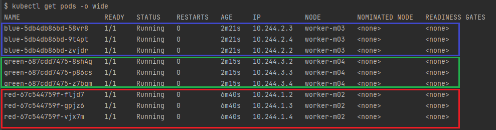

# Scheduling Exercise
Let's assume we have 3 types of applications: `red`, `blue` and `green`.

And let's assume we have 3 dedicated worker nodes, one for each type of application (`red` node, `blue` node, `green` node), but also an '`uncolored`' node which can deploy any of the 3 applications.

How can we enforce scheduling each application on it's corresponding 'colored' worker node?

#### We do not want:
1. Any application deployment to be scheduled on the wrong color node (for example `red` application should not be scheduled on `blue`/`green`/'`uncolored`' nodes.
2. Any `worker` node to accept any application deployment but the right color application (for example the `red` node should accept only the `red` deployment).

#### To solve this problem we will make use of 2 kubernetes scheduling concepts:
### 1. Taints and Tolerations: 
- reference: https://kubernetes.io/docs/concepts/scheduling-eviction/taint-and-toleration/

`taints` and `tolerations` work together to ensure that pods are not scheduled onto inappropriate nodes. 
- `taints` are applied to a node, to mark that the node should not accept any pods that do not tolerate these `taints`.
- `tolerations` are applied to pods specifying which `taints` the pod can tolerate. 

In other words `tolerations` allow the scheduler to schedule pods on a node with matching `taints`. 
However, this does not guarantee scheduling a pod on a specific node.

### 2. Node Affinity:
- reference: https://kubernetes.io/docs/concepts/scheduling-eviction/assign-pod-node/#affinity-and-anti-affinity

Node `affinity` is conceptually similar to `nodeSelector` but a lot more expressive, giving more control over the selection logic (like OR and NOT operators).
In other words, node `affinity` allows you to constrain which nodes your Pod can be scheduled on based on node labels.

# Solution
### Prerequisites:
1. Docker (version: `20.10.17`)
2. Minikube (version: `v1.26.1`)

### Requirements:
1. Create `red`, `blue` and `green` deployments and schedule each on a dedicated `worker` node.
2. Each Worker node can only accept 1 type of color deployment ('`uncolored`' node should accept all - but none should be scheduled on it).

### Steps:
1. First, lets start `minikube` cluster with 5 nodes (1 `controlplane` + 3 colored `workers` + 1 'uncolored' `worker`):
```bash
minikube start --nodes 5 -p worker

# check if all nodes are running:
kubectl get nodes
```

2. Taint the nodes to prevent unwanted pods scheduled upon them:
```bash
kubectl taint nodes worker-m02 color=red:NoSchedule
kubectl taint nodes worker-m03 color=blue:NoSchedule
kubectl taint nodes worker-m04 color=green:NoSchedule
```

3. Label the nodes for dedicated colors (will be used by the affinity rules we set next):
```bash
kubectl label nodes worker-m02 color=red
kubectl label nodes worker-m03 color=blue
kubectl label nodes worker-m04 color=green

# check the labels on each node:
kubectl describe node worker-m02
kubectl describe node worker-m03
kubectl describe node worker-m04
```

4. Create `red`, `blue` and `green` deployments manifest files:
```bash
kubectl create deploy red --image=nginx --replicas=3 --dry-run=client -o yaml > red-deployment.yaml
kubectl create deploy blue --image=nginx --replicas=3 --dry-run=client -o yaml > blue-deployment.yaml
kubectl create deploy green --image=nginx --replicas=3 --dry-run=client -o yaml > green-deployment.yaml
```

5. Edit te manifest files and add `tolerations` to each deployment, for example:
```yaml
spec:
  template:
    spec:
      #This will allow our red pods to be able to be scheduled upon the red node (they will tolerate the `color=red` taint).
      tolerations:
        - key: "color"             # label name
          operator: "Equal"        # operator
          value: "red"             # label value
          effect: "NoSchedule"    # taint-effect
```

6. Edit te manifest files and add `affinity` rules to each deployment, for example:
```yaml
spec:
  template:
    spec:
      #This will schedule our red pods ONLY on the red node (will look for `color=red` label on the node)
      affinity:
        nodeAffinity:
          requiredDuringSchedulingIgnoredDuringExecution:
            nodeSelectorTerms:
              - matchExpressions:
                  - key: color
                    operator: In
                    values:
                      - red
```

7. Apply the deployment files onto the cluster:
```bash
kubectl apply -f red-deployment.yaml
kubectl apply -f blue-deployment.yaml
kubectl apply -f green-deployment.yaml
```

8. View the pods being deployed upon the worker nodes:
```bash
kubectl get pods -o wide --watch
```

You will see each color is scheduled on a dedicated worker node designed for that specific color:

