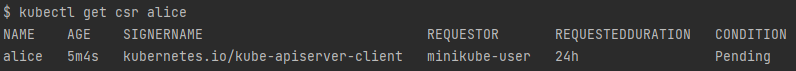
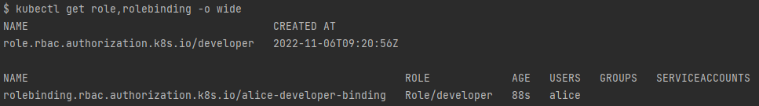

# RBAC Exercise 
Let's assume we want to create a new user named `alice` and we want it to have privileges to edit `pods` and `deployments` in the `default` namespace.

`alice` should have the following priviliges for accessing `pods` and `deployments`:
- `create`
- `watch`
- `get`
- `list`
- `update`
- `delete`

How can we first create the desired user, and give it the right permissions to access the specified resources?

**To solve this problem we will utilize of 2 `kubernetes`'s main security concepts**:
### 1. Cluster Authentication (using `CSR`) 
`CertificateSigningRequest` (`CSR`) resource is used to request that a certificate be signed by a denoted signer, after which the request may be approved or denied before finally being signed. We will use it to create a new user from scratch, and authenticate it to our cluster.
- reference: https://kubernetes.io/docs/reference/access-authn-authz/certificate-signing-requests/

### 2. `RBAC` Authorization 
`RoleBasedAccessControl` (`RBAC`) is a method of regulating access to resources based on the roles of individual users within your organization. We will be using `Role` and `RoleBinding` resources to specify which privileges `alice`.
- reference: https://kubernetes.io/docs/reference/access-authn-authz/rbac/

# Solution 

## Prerequisites:
1. Minikube `v1.26.1` - a running minikube cluster (`minikube start`)
2. Docker version `20.10.17`

## 1. Create private key 
Create a private key for alice:
```bash
# create and export a new key
openssl genrsa -out alice.key 2048

# create a CSR and export 
openssl req -new -key alice.key -out alice.csr
# set `Common Name` to `alice` on command prompt
```
you should have 2 files under `/root/` directory:
- `alice.key` - the private key of a user named `alice`
- `alice.csr` - the `request` for the CSR itself

## 2. Create `CertificateSigningRequest` resource
First we must convert the `alice.csr` request we generated earlier, to a valid base64 format.
Use this command to extract the csr under the right format:
```bash
cat alice.csr | base64 | tr -d "\n"
```
After conversion, create a new file `alice-csr.yaml` and insert the output under the `spec.request` field:
```yaml
# alice-csr.yaml
apiVersion: certificates.k8s.io/v1
kind: CertificateSigningRequest
metadata:
  name: alice
spec:
  request: MIIChTCCAW0CAQAwQDELMAkGA1UEBhMCSVMxDzANBgNVBAgMBklzcmFlbDEQMA4GA1UECgwHVGVyYVNreTEOMAwGA1UEAwwFYWxpY2UwggEiMA0GCSqGSIb3DQEBAQUAA4IBDwAwggEKAoIBAQC+yfhXtraA5VQZSqA+kw3T4PpuYmSeGB/1KRi2yYNO/PGRUZgSfz6smQezvRGrc6zNUY4u0WwT9dyRBkox1ai63DoOhEoXSu39CA++dHQZS6BLGvLd4hkugzrGNB10OH0NZjiq+W8nNP0M957U7qLfLtfZ47zVIzLKUFAiLuStiIUTkp0oNBGNJiPSckXonWKFKLa7Irrco98nfV6MwfXeeuntq+b1HQX3/P/AvVRksuGc3SbVO0cbQ8Rk1sns4m4qW1bHJZxpRIA2WfJIPywhpUxnOyWKsonDOdgHhp5iI1zqjUA3q5D2kPk2EhtMWkZ69aU6ANg6Df+BJWTcauNLAgMBAAGgADANBgkqhkiG9w0BAQsFAAOCAQEAAvt9FyO/uwIZJEUQnZ8QFLCp9Tv1xOgd1ZgU6f0QKCj6YVFLrvUL5jWD484AZno+cJHTbROTQaYrFMGInZIteo82tQMQ5pI4HM2TE9Z8eksiARY54M4JfLPxItcX5AD1gEnBxWZVnwitcFfjnmauwROofXYWS7w88YZrO+8owPwkNoilb1bgrsGJ9Pk2fj1nQytxeYZ8wLyeIbo7LMcoTK9jt4l+gQ/QYZUr7dzRqqS8fqNABzHAunopQ3SWbJGcLd32dOu7/00fkBScuaw1Mz9ZxtMzpqP9gG5TzSuXea/KNp+DHxsPqnGrxPj3zV5fkqv+DDOyJVYukYrFNUQ2aQ==
  signerName: kubernetes.io/kube-apiserver-client
  expirationSeconds: 86400  # one day
  usages:
  - client auth
```
**important**
- `usages` - must be set to `client auth`
- `expirationSeconds` - CSR expiration in seconds.
- `request` - is the base64 encoded value of the CSR file content

Don't forget to apply the CSR resource:
```bash
kubectl apply -f alice-csr.yaml
```
**output:**


Check to see the state of the CSR:
```bash
kubectl get csr alice
```
**output:**



The CSR is `Pending` because no certified authority have yet approved that request.


## 3. Approve the `CertificateSigningRequest`
```bash
# list all CSR's
kubectl get csr

# approve alice's CSR
kubectl certificate approve alice
```
**output:**


```bash
# check to see that the CSR is actually approved
kubectl get csr alice
```
Now we can see the CSR was approved:

**output:**


## 4. Get the user certificate 
This will be useful for later use:
```bash 
kubectl get csr alice -o jsonpath='{.status.certificate}'| base64 -d > alice.crt
```
you should have 3 files under `/root/` directory:
- `alice.key` - the private key of a user named `alice`
- `alice.csr` - the `request` for the CSR itself.
- `alice.crt` - a certificate authenticating `alice` as a valid user for our cluster.

If we try to access `pods` or `deployments` in the `default` namespace as `alice, we cannot access any resource:
```bash
kubectl get pods,deployments --as=alice
```

**output:**


This happens because we did not authorized `alice` access to these resources.

We can allow `alice` to access these resources with the use of `Role` and `RoleBinding` resources.  

## 5. Create `Role` and `RoleBinding`
### Create a developer `Role`
```bash
# generate a role yaml file
kubectl create role developer --verb=create,watch,get,list,update,delete --resource=pods,deployments -o yaml --dry-run=client > developer-role.yaml

# apply the role
kubectl apply -f developer-role.yaml
```
Your `Role` yaml file should look like this:
```yaml
# developer-role.yaml
apiVersion: rbac.authorization.k8s.io/v1
kind: Role
metadata:
  creationTimestamp: null
  name: developer
rules:
- apiGroups:
  - ""
  resources:
  - pods
  verbs:
  - create
  - watch
  - get
  - list
  - update
  - delete
- apiGroups:
  - apps
  resources:
  - deployments
  verbs:
  - create
  - watch
  - get
  - list
  - update
  - delete
```

**output:**


### Create `RoleBinding` to bind `alice` user to the `developer` role
```bash
kubectl create rolebinding alice-developer-binding --role=developer --user=alice -o yaml --dry-run=client > alice-developer-rolebinding.yaml

# apply the role
kubectl apply -f alice-developer-rolebinding.yaml
```
Your `RoleBinding` yaml file should look like this:
```yaml
# alice-developer-rolebinding.yaml
apiVersion: rbac.authorization.k8s.io/v1
kind: RoleBinding
metadata:
  creationTimestamp: null
  name: alice-developer-binding
roleRef:
  apiGroup: rbac.authorization.k8s.io
  kind: Role
  name: developer
subjects:
- apiGroup: rbac.authorization.k8s.io
  kind: User
  name: alice
```
**output:**


```bash
# check the role and rolebinding we created:
kubectl get role,rolebinding
```

**output:**


As we can see, `alice` is bound to `developer` role due to the `alice-developer-rolebinding` role binding resource.

## 6. Validate 
Let's validate `alice` can access `pods` and `deployments`:
```bash
# create deployment
kubectl create deployment web-app --image=nginx --replicas=3 --as=alice
```
**output:**


```bash
# get pods and deployments
kubectl get pods,deployments --as=alice
```
**output:**


```bash
# get pods and deployments
kubectl delete deployment web-app --as=alice
```
**output:**

